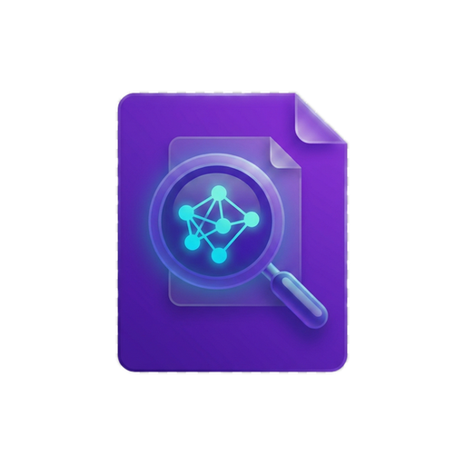

<p align="center">
  
</p>

<h1 align="center">RAG Search</h1>
<p align="center">
  <strong>Ứng dụng tìm kiếm tài liệu thông minh — triển khai mô hình RAG hoàn chỉnh trên desktop</strong>
</p>

<p align="center">
  <a href="https://github.com/azoom-pham-the-tho/rag-search/releases"></a>
  <a href="https://github.com/azoom-pham-the-tho/rag-search/actions"></a>
  
</p>

---

## Mô hình RAG là gì?

**RAG (Retrieval-Augmented Generation)** là một kiến trúc AI gồm 3 giai đoạn:

```
  ┌─────────────┐      ┌─────────────┐      ┌─────────────┐
  │  RETRIEVAL   │ ───→ │ AUGMENTATION │ ───→ │ GENERATION   │
  │  Tìm kiếm   │      │  Bổ sung     │      │  Sinh câu    │
  │  tài liệu   │      │  ngữ cảnh    │      │  trả lời     │
  └─────────────┘      └─────────────┘      └─────────────┘
```

**Tại sao cần RAG?** — AI (ChatGPT, Gemini) rất giỏi ngôn ngữ, nhưng chúng **không biết nội dung tài liệu riêng của bạn**. RAG giải quyết bằng cách: tìm thông tin liên quan trong tài liệu trước → đưa vào prompt → AI trả lời chính xác kèm nguồn trích dẫn.

Nhưng trước khi "Retrieval" hoạt động được, cần **một giai đoạn chuẩn bị** để tài liệu sẵn sàng được tìm kiếm. Vậy thực tế, một hệ thống RAG hoàn chỉnh có **4 giai đoạn**:

```
  ┌─────────────┐      ┌─────────────┐      ┌─────────────┐      ┌─────────────┐
  │  INGESTION   │ ───→ │  RETRIEVAL   │ ───→ │ AUGMENTATION │ ───→ │ GENERATION   │
  │              │      │              │      │              │      │              │
  │  Nạp & xử lý│      │  Tìm kiếm    │      │  Lọc, xếp    │      │  AI sinh     │
  │  tài liệu   │      │              │      │  hạng, ghép   │      │  câu trả lời │
  └─────────────┘      └─────────────┘      └─────────────┘      └─────────────┘
    Chạy 1 lần           Mỗi câu hỏi         Mỗi câu hỏi         Mỗi câu hỏi
    (+ auto sync)
```

Dưới đây là cách **RAG Search** triển khai từng giai đoạn.

---

## Giai đoạn 1: Ingestion — Nạp & xử lý tài liệu

> _"Biến tài liệu thô thành dữ liệu có thể tìm kiếm"_

<p align="center">
  
</p>

Khi người dùng thêm thư mục, hệ thống thực hiện 4 bước:

### Bước 1 — Document Parsing (Đọc file)

Hệ thống dùng engine **Kreuzberg** (Rust) để đọc 75+ định dạng file:

| Loại        | Formats               | Cách xử lý                                    |
| ----------- | --------------------- | --------------------------------------------- |
| Văn bản     | PDF, DOCX, ODT, RTF   | Extract text + giữ cấu trúc heading           |
| Bảng tính   | XLSX, XLS, ODS, CSV   | Đọc từng sheet, giữ header cột                |
| Trình chiếu | PPTX, PPT, ODP        | Extract text từ slides                        |
| Web         | HTML, XML, JSON, YAML | Parse markup → plain text                     |
| Ảnh         | JPG, PNG, TIFF, BMP   | **OCR** (Tesseract) — nhận dạng chữ trong ảnh |

> 💡 **OCR được bundle sẵn trong app** (Tesseract static-linked + tessdata Eng/Vie/Jpn) — người dùng không cần cài thêm gì.

### Bước 2 — Chunking (Chia nhỏ văn bản)

Tài liệu dài không thể đưa nguyên vào AI (giới hạn context window). Hệ thống chia thành **chunks** ~2KB với overlap:

```
Tài liệu gốc (50 trang):
┌──────────────────────────────────────────────────┐
│ ▓▓▓▓▓▓▓▓▓ Chunk 1 (2KB) ▓▓▓▓▓▓▓▓▓              │
│              ░░░ overlap ░░░                      │
│              ▓▓▓▓▓▓▓▓▓ Chunk 2 (2KB) ▓▓▓▓▓▓▓▓▓  │
│                           ░░░ overlap ░░░         │
│                           ▓▓▓▓▓▓▓▓▓ Chunk 3 ...  │
└──────────────────────────────────────────────────┘
```

- **Excel/ODS**: Chunk 4KB (lớn hơn để giữ nguyên bảng)
- **PDF/DOCX**: Chunk 2KB, overlap 200 chars (đảm bảo không cắt giữa câu)

### Bước 3 — Dual Indexing (Index kép)

Mỗi chunk được đưa vào **2 hệ thống tìm kiếm cùng lúc**:

```
                    ┌───────────────────────────────┐
                    │        Text Chunks             │
                    │   (từ bước chunking)           │
                    └───────────┬───────────────────┘
                                │
                   ┌────────────┴────────────┐
                   ▼                         ▼
        ┌──────────────────┐      ┌──────────────────┐
        │  BM25 Index       │      │  Vector Index     │
        │  (Tantivy)        │      │  (HNSW Graph)     │
        │                   │      │                   │
        │  Đánh chỉ mục     │      │  text → Gemini    │
        │  theo từ khóa     │      │  Embedding API    │
        │                   │      │  → vector 768-dim │
        │  Giỏi tìm chính  │      │                   │
        │  xác: "hóa đơn   │      │  Giỏi tìm ngữ    │
        │  số 12345"        │      │  nghĩa: "chi phí  │
        │                   │      │  ship" ≈ "phí vận │
        │                   │      │  chuyển"          │
        └──────────────────┘      └──────────────────┘
```

**Tại sao cần 2 index?**

- Tìm `"ABC-12345"` → BM25 match chính xác, vector có thể miss
- Tìm `"chi phí vận chuyển"` → Vector hiểu đồng nghĩa với "phí ship", BM25 miss
- **Kết hợp cả hai = kết quả tốt nhất** — đây gọi là **Hybrid Search**

### Bước 4 — Auto Sync (Đồng bộ tự động)

<p align="center">
  
</p>

Hệ thống dùng **OS-native file watcher** lắng nghe thay đổi file:

- macOS: FSEvents (kernel-level)
- Windows: ReadDirectoryChangesW

Khi file thêm/sửa/xóa → tự động re-index (debounce 2s) → người dùng luôn tìm kiếm trên dữ liệu mới nhất.

**Startup Diff**: Khi mở app, so sánh DB vs filesystem → phát hiện thay đổi xảy ra khi app đang tắt.

---

## Giai đoạn 2: Retrieval — Tìm kiếm

> _"Từ câu hỏi, tìm ra chunks liên quan nhất"_

<p align="center">
  
</p>

Khi người dùng gõ câu hỏi, hệ thống trải qua **4 layer xử lý**:

### Layer 0 — Fast Follow-up Detection `(<1ms)`

Trước khi tìm kiếm, hệ thống kiểm tra: _"Đây có phải câu hỏi tiếp nối không?"_

| Signal              | Ví dụ                                 | Hành động               |
| ------------------- | ------------------------------------- | ----------------------- |
| Đại từ tham chiếu   | "**nó** là gì?", "**file đó** có gì?" | Dùng lại context cũ     |
| Từ tiếp nối         | "**thêm** chi tiết", "**tiếp tục**"   | Dùng lại context cũ     |
| Keyword trùng >40%  | Cùng topic với câu trước              | Dùng lại context cũ     |
| Topic hoàn toàn mới | "Tìm cho tôi về nghiệp vụ X"          | **Tìm kiếm lại từ đầu** |

> Nếu là follow-up → skip hoàn toàn giai đoạn Retrieval → tiết kiệm ~2-3 giây.

### Layer 1 — Keyword Extraction `(~1.5s)`

Dùng **Gemini Flash** (model nhẹ, nhanh) để trích xuất từ khóa thông minh:

```
Câu hỏi: "Cho tôi hóa đơn tháng 3 năm ngoái của công ty ABC"
    ↓ AI phân tích
Keywords: ["hóa đơn", "tháng 3", "ABC"]
Intent:   "lookup" (tra cứu)
```

Đặc biệt:

- **Hiểu context hội thoại** — biết "nó" trong câu follow-up chỉ cái gì
- **Compound term** — giữ nguyên cụm "Test 123" thay vì tách thành "Test" + "123"
- **Fallback** — nếu AI chậm/lỗi → dùng heuristic (cắt stop words) trong 0ms

### Layer 2 — Hybrid Search `(~40ms)`

Chạy **song song** 2 engine tìm kiếm bằng `tokio::join!`:

```
Keywords ──→ BM25 Search (Tantivy)   → top 10 kết quả (exact match)
         └→ Vector Search (HNSW)     → top 15 kết quả (semantic match)
                        ↓
                Merge & Re-rank
                (composite score)
                        ↓
              Top files phù hợp nhất
```

---

## Giai đoạn 3: Augmentation — Bổ sung ngữ cảnh

> _"Chọn lọc và chuẩn bị context tốt nhất cho AI"_

Đây là giai đoạn quan trọng nhất nhưng ít được nói tới. Không phải cứ tìm được tài liệu là đưa hết cho AI — cần **lọc, xếp hạng, cắt gọn** để AI nhận được thông tin chất lượng cao nhất.

### Context Builder — Bộ xây dựng ngữ cảnh

```
Files tìm được → Score từng chunk → Lọc theo threshold → Budget theo intent → PII mask → Prompt
```

**Chunk Scoring — AND-majority rule:**

Mỗi chunk được chấm điểm: phải chứa **≥50% keywords** mới tính là phù hợp.

```
Keywords: ["hóa đơn", "tháng 3", "ABC"]

Chunk A: "Hóa đơn công ty ABC ngày 15/3..."  → 3/3 match = 100% ✅ Chọn
Chunk B: "Hóa đơn tháng 5 XYZ..."             → 1/3 match = 33%  ❌ Bỏ qua
Chunk C: "Doanh thu tháng 3 công ty ABC..."   → 2/3 match = 67%  ✅ Chọn
```

**Dynamic Budget — Ngân sách context theo loại câu hỏi:**

| Intent AI phát hiện    | Budget     | Lý do                      |
| ---------------------- | ---------- | -------------------------- |
| `lookup` (tra cứu)     | 40K chars  | Chỉ cần vài dòng chính xác |
| `summarize` (tóm tắt)  | 120K chars | Cần đọc nhiều để tóm lược  |
| `compare` (so sánh)    | 80K chars  | Cần dữ liệu từ nhiều nguồn |
| `aggregate` (thống kê) | 120K chars | Cần dữ liệu đầy đủ         |
| `extract` (trích xuất) | 80K chars  | Cần context có cấu trúc    |

**PII Masking — Bảo vệ dữ liệu nhạy cảm:**

Trước khi gửi context cho AI, hệ thống che:

- Số điện thoại → `[SĐT]`
- Email → `[EMAIL]`

> Tài liệu gốc **không bao giờ rời khỏi máy**. Chỉ keyword + context snippet đã lọc được gửi tới AI.

---

## Giai đoạn 4: Generation — AI sinh câu trả lời

> _"AI đọc context, trả lời bằng ngôn ngữ tự nhiên, kèm nguồn trích dẫn"_

### Prompt Engineering

Hệ thống tạo prompt khác nhau tùy loại câu hỏi:

```
[System Prompt]
Bạn là trợ lý tìm kiếm tài liệu. Trả lời DỰA TRÊN context được cung cấp.
Khi trích dẫn, ghi rõ nguồn [1], [2]...

[Context — từ giai đoạn Augmentation]
=== File: invoices.xlsx ===
STT | Mã HĐ | Công ty | Tháng | Số tiền
1   | HD001  | ABC     | 3     | 50,000,000đ
...

[History — tóm tắt hội thoại trước]
User hỏi về hóa đơn, tìm được file invoices.xlsx

[User Query]
Cho tôi hóa đơn tháng 3 của công ty ABC
```

### Streaming Response

Câu trả lời được stream real-time (từng token):

- Người dùng thấy text xuất hiện dần (như ChatGPT)
- Không phải đợi AI xong mới hiện

### Citation — Trích dẫn nguồn

AI tự ghi nguồn: _"Theo invoices.xlsx [1], công ty ABC có hóa đơn HD001 trị giá 50 triệu..."_

Hệ thống verify: kiểm tra AI có thực sự dùng file được cung cấp hay "bịa" → chỉ hiện source file nào AI thật sự trích dẫn.

### Multi-key Rotation

Khi API key bị rate limit (429) → tự động chuyển sang key tiếp theo → không gián đoạn trải nghiệm.

---

## Điểm khác biệt so với RAG thông thường

| Tiêu chí       | RAG cloud (LangChain, LlamaIndex) | RAG Search                   |
| -------------- | --------------------------------- | ---------------------------- |
| Chạy ở đâu     | Server / Cloud                    | **100% trên máy cá nhân**    |
| Dữ liệu đi đâu | Upload lên server                 | **Không bao giờ rời máy**    |
| Cần setup      | Python, Docker, vector DB         | **Download → Cài → Dùng**    |
| Tìm kiếm       | Thường chỉ vector                 | **Hybrid BM25 + Vector**     |
| OCR            | Cần cài riêng                     | **Bundle sẵn (Tesseract)**   |
| Đồng bộ file   | Manual re-index                   | **Auto watcher (OS-native)** |
| Follow-up      | Search lại mỗi câu                | **Fast follow-up <1ms**      |
| Ngôn ngữ       | Python (chậm)                     | **Rust (nhanh, type-safe)**  |

---

## Công nghệ sử dụng

### Backend — Rust

| Thành phần       | Công nghệ                     | Vai trò                          |
| ---------------- | ----------------------------- | -------------------------------- |
| Framework        | **Tauri v2**                  | Desktop app, IPC bridge          |
| Full-text Search | **Tantivy**                   | BM25 inverted index              |
| Vector Search    | **HNSW** (instant-distance)   | 768-dim cosine similarity        |
| Database         | **SQLite** (rusqlite)         | Metadata, settings, chat history |
| Document Parser  | **Kreuzberg**                 | 75+ formats + OCR                |
| OCR              | **Tesseract** (static-linked) | Eng + Vie + Jpn                  |
| AI API           | **Gemini** (reqwest)          | Chat streaming + embedding       |
| File Watcher     | **notify**                    | FSEvents / ReadDirectoryChangesW |
| Async Runtime    | **Tokio**                     | Non-blocking I/O                 |
| Parallelism      | **Rayon**                     | Multi-core parse + chunk         |

### Frontend — Vanilla JS + CSS

- Zero framework, zero build step
- Dark theme, real-time streaming UI
- Lucide Icons

### CI/CD — GitHub Actions

- Auto build khi push tag
- Output: macOS `.dmg` + Windows `.msi`/`.exe`

---

## Hiệu năng

| Metric                | Giá trị                        |
| --------------------- | ------------------------------ |
| Hybrid Search         | ~40ms                          |
| Fast follow-up        | <1ms                           |
| HNSW nearest neighbor | O(log n)                       |
| AI keyword extraction | ~1.5s (timeout → fallback 0ms) |
| File watch debounce   | 2s                             |
| Startup diff          | <100ms                         |

---

## Cài đặt

### Download

👉 [**Releases**](https://github.com/azoom-pham-the-tho/rag-search/releases)

- **macOS (Apple Silicon)**: `.dmg`
- **macOS (Intel)**: `.dmg`
- **Windows**: `.msi` / `.exe`

### Yêu cầu

- [Gemini API key](https://aistudio.google.com/apikey) (miễn phí)

### Sử dụng

1. Cài đặt app
2. Settings → Nhập Gemini API key
3. Thêm thư mục tài liệu → Đợi index
4. Bắt đầu chat / tìm kiếm!

### Development

```bash
brew install rust node tesseract
git clone git@github.com:azoom-pham-the-tho/rag-search.git
cd rag-search && npm install
npm run tauri dev
```

---

## Cấu trúc dự án

```
ragSearch/
├── src/                              # Frontend (Vanilla JS)
│   ├── index.html                    # SPA entry
│   ├── js/
│   │   ├── api.js                    # Tauri IPC
│   │   ├── chat.js                   # Chat UI (streaming)
│   │   ├── folder.js                 # Folder management
│   │   └── settings.js              # Settings
│   └── styles/                       # CSS (dark theme)
│
├── src-tauri/                        # Backend (Rust)
│   └── src/
│       ├── ai/                       # Gemini API client
│       ├── commands/search/          # RAG pipeline core
│       │   ├── pipeline.rs           # Orchestrator (4 layers)
│       │   ├── context.rs            # Context builder (scoring)
│       │   ├── keyword.rs            # Keyword extraction
│       │   └── prompt.rs             # Prompt engineering
│       ├── embedding/                # Vector embedding (Gemini)
│       ├── indexer/                   # BM25 + Chunker
│       ├── parser/                    # Document parsing + OCR
│       ├── search/                    # Hybrid search engine
│       └── watcher/                   # File change detection
│
└── .github/workflows/
    └── release.yml                    # CI/CD
```

---

## Kỹ năng áp dụng

**Systems Programming** — Rust ownership, async/await, Arc/Mutex, FFI (C++ Tesseract)

**Information Retrieval** — BM25, vector embeddings, hybrid search, HNSW, compound term matching

**AI Engineering** — RAG pipeline, prompt engineering per intent, streaming LLM, rate limit handling, token budgeting

**Desktop Development** — Tauri v2, OS-native file watching, cross-platform bundling, OCR static-linking

**DevOps** — GitHub Actions CI/CD, multi-platform auto-build

---

<p align="center">
  Built with ❤️ using <strong>Rust</strong> + <strong>Tauri v2</strong> + <strong>Gemini AI</strong>
</p>
